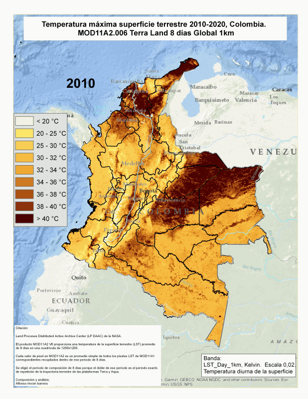

# TempSuperf_Colombia_MODISTerra_8day

  

Citación:

Land Proceses Distributed Active Archive Center (LP DAAC) de la NASA.

El producto MOD11A2 V6 proporciona una temperatura de la superficie terrestre (LST) promedio de 8 días en una cuadrícula de 1200x1200. 

Cada valor de pixel en MOD11A2 es un promedio simple de todos los pixeles LST de MOD11A1 correspondientes recopilados dentro de ese período de 8 días.

Se eligió el período de composición de 8 días porque el doble de ese período es el período exacto de repetición de la trayectoria terrestre de las plataformas Terra y Aqua.

Composición y análisis:
Alfonso rincón barrera
